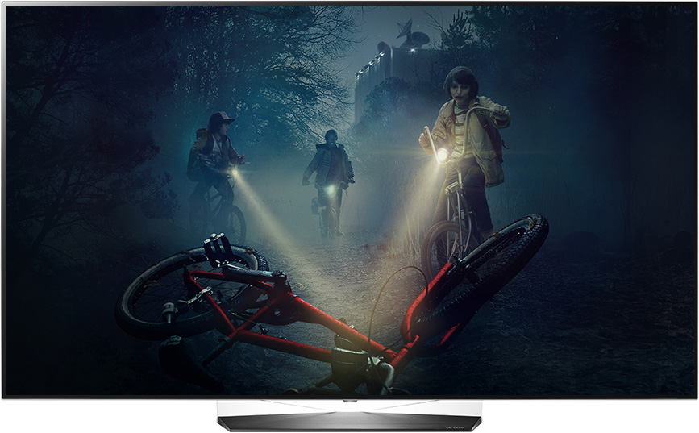
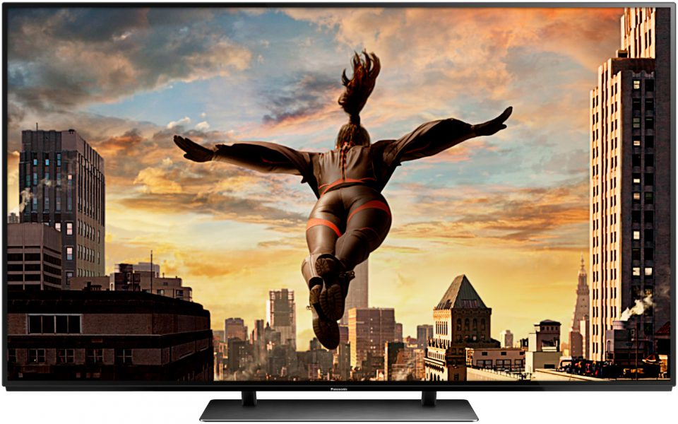
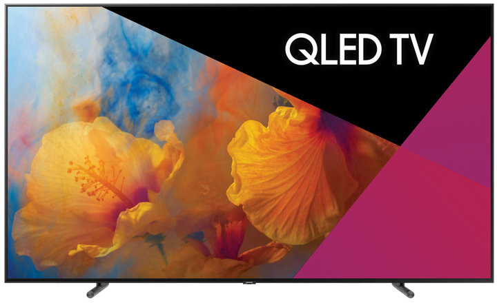
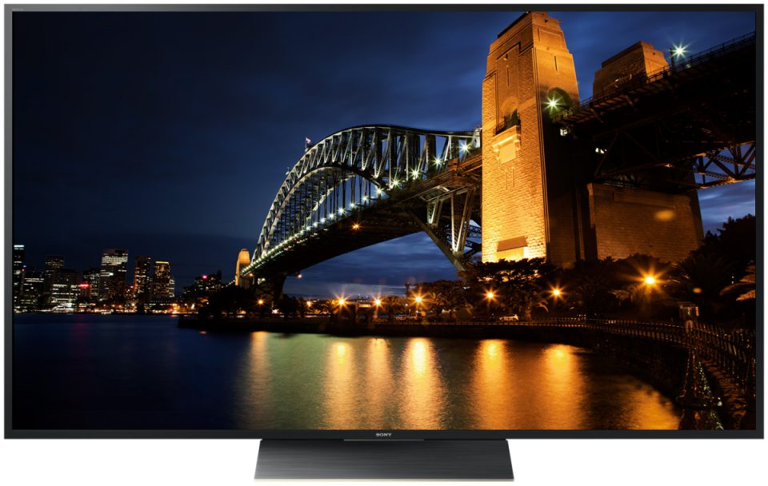

> UPDATE:The Panasonic EZ952 has been replaced with the flagship EZ1002 to avoid any doubt its the best on offer from Panasonic. HDTVtest have also secured a professional broadcast reference monitor to act as reference!

In a couple of weeks time, I’ll be taking part in HDTVtest’s annual TV Shootout, where 5 of the best TVs available today will be compared side by side by a group of AV enthusiasts to rank them in a number of categories.

The event is being hosted by [HDTVtest](http://www.hdtvtest.co.uk/) and [Crampton & Moore](http://www.cramptonandmoore.co.uk/leeds) and is open to the public, you just need to [register for free](http://www.hdtvtest.co.uk/news/2017-shootout-201707244487.htm) if you are interested in attending.

I’ve been thinking about a TV upgrade for some time now, so this will be a very useful event to help narrow down what kind of display technology to go for. It will be a rare opportunity to see these televisions side by side properly calibrated, not in ‘shop mode’.

The TVs being showcased are as follows:

* LG B7 (OLED65B7V) OLED TV
* Panasonic EZ952 (TX-65EZ952B) OLED TV
* Samsung Q9 (QE65Q9F) QLED TV
* Sony A1 (KD-65A1) OLED TV
* Sony ZD9 (KD-65ZD9) LED LCD TV

There are two main screen technologies available at the moment, firstly OLED, used by the LG B7, the Panasonic EZ952 and the Sony A1, and advanced LED LCDs being used by the Samsung Q9 and Sony ZD9 – both have pros and cons for different types of content in different environments.

If you want to learn more about HDR, what it is and how it improves the home entertainment experience, read my post:

## The Contenders

### LG B7

This year all of LG’s OLED TVs share the same panel and image processor, so the image quality on this ‘entry’ level model should be the same as their flagship W series. It has a peak brightness of around 750 nits in a 10% window or 150 nits full field – and this is the biggest downside of current OLED tech, with a very bright scene, the whole image is dimmed in order to protect the panel from damage. In a dark environment where you don’t need to have lots of brightness, it will be less noticeable, but will probably be a problem in bright viewing environments. The B7 is the only model in the shootout that currently supports Dolby Vision, although both of the Sony models will receive a firmware update later this year to enable Dolby Vision.

### Panasonic EZ952

The Panasonic EZ952 has on paper got a peak brightness of 1000 nits, but this drops to around 650 nits once calibrated, so not the punchiest screen out there, but the colour calibration is reportedly sublime – I’m looking forward to see this for myself, but it has been tested to be almost as good as professional reference monitors. I’ll have to see how the image processing holds up with the competition.

### Sony A1

The third OLED in the test, and the TV with far the best on-board sound. Sony are using a special driver that uses the glass as the speaker, giving impressive sound. Although I doubt many people spend £4,800 on a TV and don’t have some sort of surround sound solution, so perhaps this adds cost for something that will rarely be used? The panel itself is made by LG and is likely very similar to the one in the B7, certainly peak brightness is the same 750 nits once calibrated. The differences will come from Sony’s ‘X1 Extreme’ image processor which it shares with the ZD9.

### Samsung Q9

The Samsung Q9 uses ‘Quantum Dot’ technology to boost the colours on the LCD panel. Quantum dots are very small semiconductor particles often, only nanometers across, that emit certain frequencies of light when excited. The Q9 is capable of outputting 1600 nits once calibrated, roughly twice the brightness of the best OLEDs so I expect bright scenes to be very dynamic. The Q9 has a edgelit LED backlight system, so black level performance will probably not be amazing; it should be noticeably worse in dark scenes and in darker viewing environments.

### Sony ZD9

Finally we have the Sony ZD9, an LED LCD TV with a staggering 1800 nits of peak brightness after calibration. If this TV doesn’t make HDR content look incredible, then nothing will! In bright scenes, this should blow away the OLEDs, but in darker scenes it will likely not be as impressive. It does however have Full Array Local Dimming, with 640 seperate zones, this means that the screen is split into 640 smaller zones, each one can have its backlight dimmed independently which should give much better contrast in darker scenes than the Samsung Q9 can manage. FALD can cause haloing or blooming around highlights where the zones near the highlight must have their backlights on, but other zones do not – and it really depends how good Sony’s algorithm is at managing the dimming to see if this is noticeable in anything other than test patterns.

## Predictions

I’ve only seen a few of these TVs in shops, not in a realistic environment, nor properly calibrated, so I can only guess which I think will be best based on Specs and Reviews from the likes of [HDTVtest](http://www.hdtvtest.co.uk/).

I think the OLEDs will all be very similar, with the only differences coming from the different image processors and approaches to tone mapping.

I think the Q9 and ZD9 will both have more impact with HDR content, but the Q9 will probably be the worst in dark scenes due to its edge lit LCD panel – the ZD9 should fair better with its full array local dimming, but it will certainly be interesting to see how good it is compared to the OLEDs!

## Final Thoughts before the Shootout

I haven’t seen any consumer HDR content yet (apart from terrible shop demo scenes) and it will be interesting to see how it compares to digital cinema which uses DCI-P3, a 12-bit colour space.

I am also interested to see how movies mastered to 1000 nits look compared to 4000 nit titles – the OLEDs have a lot less work to do to display a 1000 nit title compared to a 4000 nit title, and the two LCDs should have no trouble at all with 1000 nit titles. LCDs should theoretically fair much better with the brighter titles too as they have a lot more headroom.

Dark scenes are probably the biggest annoyance with my current TV as it tends to get fuzzy and start posterising the shadows making them blocky – you’d kind of expect this from streamed content, but not a pristine Bluray source. Hopefully all of these new generation TVs will do a better job.

Finally, I’m keen to see how much of a difference there is between HDR10 and Dolby Vision. On paper Dolby Vision has a significant advantage, but how much of a real world difference is there on today’s panels?