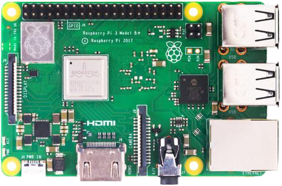
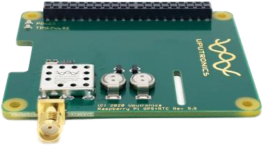

Accurate, synchronised time is a very useful thing for electronic devices to have. Nearly every modern electronic device that can connect to the internet will use NTP (Network Time Protocol) servers to synchronise their internal clocks; PCs, laptops, tablets, TVs, mobiles etc, will all use internet based NTP servers to adjust their clocks.

For the most part, this is fine - all of your devices will likely have the correct time to the nearest second. Network delays (ping) can add a small margin of error to time you recieve, but its unlikely to cause an issue in the home environment. However, if like me you have [segregated your network](/technology/2019/home-networks-for-iot/) and blocked internet access to any of your IOT devices, these will not be able to synchronise their clocks and may drift significantly over time - especially after power cuts if they don't have battery on board to maintain a clock. My IP cameras clocks drifted by as much as 20 minutes, which is less than ideal and made it difficult to find time based events in the footage - it would also cause issues if the footage was ever needed as evidence as the timestamp would be completely wrong!

To fix this issue I've built a stratum-1 NTP time server on a Raspberry Pi using GPS as the preferred time source. 

## The accuracy of time servers

NTP servers are graded by their accurancy. A reference clock such as a cesium based atomic clock or GPS based hardware is referred to as a stratum-0 source, however these sources cannot be used on a network as the network itself introduces too much inaccuracy. A stratum-0 source is used as the direct input for a stratum-1 NTP server. The basic definition of a statum-1 time server is that it is directly connected to an accurate time source. A stratum-1 time server acts as a primary network time standard. From there a stratum-2 server is connected over a network to a stratum-1 server, a stratum-3 to a stratum-2 and so on.

As you progress through different strata there are network delays involved that reduce the accuracy of the NTP server in relation to UTC. Typically a startum-1 time server is accurate to less than 10 microseconds (or 0.00001 seconds), each additional strata will add anything from 0.5 - 100 milliseconds of network based time error (up to 0.1 seconds).

For more information on NTP strata read this wikipedia article on [NTP Servers Clock Strata.](http://en.wikipedia.org/wiki/NTP_server#Clock_strata)

## Required Parts to build a cheap stratum-1 NTP server

1. A Raspberry Pi - pretty much any Pi with an ethernet port will be fine, a Pi 4 model B would be the best as the ethernet controller is directly connected to the SoC via PCIE rather than via the shared USB bus as on the earlier models. Sharing this bus can cause inaccurate ethernet timings, but so long as the Pi is being used exclusively for the NTP server and has no USB devices connected, you should be fine. I'm using a raspberry Pi 3 B+. **Cost: £34**

   
2. A GPS hat with PPS (Pulse Per Second). We could have used a USB GPS reciever, but that would use the USB bus (see above about older Pis) and we would only have accuracy to nearest 500 ms due to how serial connections work - to get accuracy needed for a stratum-1 NTP server we need PPS where a extremely accurate timing pulse is sent at the start of each second - more on this later. I used a Uputronics Raspberry Pi GPS/RTC HAT. **Cost £42**

   
3. External GPS Antenna. Some GPS HATs have antennas built in, but for me having an external antenna gives me flexibility to locate the pi and the antenna where it can see sattelites. I used an Adafruit External Active GPS Antenna with 28 dB gain and 5m Cable. **Cost £15**

   
4. Power suppy, case, ethernet cable, SD Card. I won't detail these here. I'm also using the Raspberry Pi POE hat to power the Pi and GPS HAT, but I still need to find a case to fit the double stacked Pi into! **Estimated Cost £25**

Total cost for Pi based stratum-1 NTP server £114. Typical cost for a commercial stratum-1 NTP server £500-£1000.

## Building the NTP server.

Thank you to [Johannes Weber](https://weberblog.net/ntp-server-via-gps-on-a-raspberry-pi/), [Steve Friedl](http://www.unixwiz.net/techtips/raspberry-pi3-gps-time.html) and [Nick Sayer](https://hackaday.io/project/15137/instructions) for your guides - all of which were very useful to help me create my own Pi based NTP server.

This guide assumes you know how to install and setup a Raspberry Pi, if not I've made a handy [Raspberry Pi Guide](http://localhost:8000/iot/2020/setting-up-a-pi-the-right-way-according-to-me/) to get you started.

### Step 1: Configuring the hardware serial port

Before we can setup the NTP server, we need to do a little bit of housekeeping on our Pi. First we need to disable the serial login shell while keeping the hardware port enabled:

```shell
sudo raspi-config
```

Then navigate to **3 Interface Options** > **P6 Serial Port** then choose the following options:

* *Would you like a login shell to be accessible over serial?* > **No**
* *Would you like the serial port hardware to be enabled?* > **Yes**

If you are using a Raspberry Pi 3 or newer with bluetooth, we will need to disable this as we want to use the hardware UART directly for the GPS reciever. This is done in a few steps.

#### Disable the console getty services

We want to disable the serial console as we want to use the UART directly for our GPS Hat

```shell
sudo systemctl stop serial-getty@ttyAMA0.service
sudo systemctl disable serial-getty@ttyAMA0.service
```

#### Disable Bluetooth and steal the hardware UART

As I am dedicating this Pi to be solely my NTP server, I have no use for the bluetooth so I am going to disable it completely. To do this we can use the Device Tree Overlay facility to easily tailor the low-level device behaviour.

Edit */boot/config.txt* and add the following lines:

```shell
# Disable BT - Use the /dev/ttyAMA0 UART for GPS, not Bluetooth
dtoverlay=pi3-disable-bt
```

Those wishing to actually use Bluetooth with the software UART can do so, though with reduced efficiency, with:

```shell
# Use software UART for Bluetooth
enable_uart=1
dtoverlay=pi3-miniuart-bt
```

And though not strictly necessary, we can also disable the *hciuart* service that nominally attempts to talk to the UART; this may provent some warnings in the log files:

```shell
sudo systemctl disable hciuart
```

We will need to reboot to make these changes.

### Step 2: Test that we have a working GPS signal over the serial port

Now is a good time to test that we have correctly configured the hardware UART to allow the GPS hat to communicate with our Pi. We can easily test this using the following command:

```shell
cat /dev/ttyAMA0
```

You should see an output similar to this:

```shell
$GPGGA,052731.000,3343.3943,N,11749.3064,W,2,04,3.93,24.8,M,-34.2,M,0000,0000*65
$GPGSA,A,3,13,17,28,19,,,,,,,,,4.05,3.93,0.99*0C
$GPRMC,052731.000,A,3343.3943,N,11749.3064,W,0.84,313.46,240117,,,D*74
...
```

### Step 3: Enable PPS (Pulse Per Second) support

We've got working GPS data, but in order to get the precision required for our stratum-1 NTP server we also need PPS. As the serial data include a whole bunch of information or noise that we don't really care about, such as longitude, latitude, number of satellites, signal strength etc, we don't always get the exact same data each second. The time sentence might not always be 'on-time' -  it can be as much as 500ms late.

To solve this we can leverage PPS, which is a super precise pulse that indicates the start of each new second.

#### Enable PPS Support in the kernel

Linux has special kernal support for PPS input via a GPIO pin on our Raspberry Pi. To enable it we need to edit two of the config files.

Edit */boot/config.txt* and add this line:

```shell
dtoverlay=pps-gpio,gpiopin=18
```

NOTE: different GPS hats use different GPIO pins for PPS; check your documentation to see whether it's using GPIO #4 or GPIO #18 and edit above as needed.

Edit */etc/modules* and add this line:

```shell
pps-gpio
```

Reboot for these changes to take effect.

#### Install pps-tools

This is a standard package, but not installed by default. Install using:

```shell
sudo apt-get install pps-tools
```

We can now test that we are getting PPS on the GPIO pin. (Note this won't work if your GPS reciever doesn't have a fix - the GPS hat I'm using has a *timepulse* LED that flashes on each second once it has a fix.

```shell
sudo ppstest /dev/pps0
```

You should get an output similar to this with a new line added each second:

```shell
trying PPS source "/dev/pps0"
found PPS source "/dev/pps0"
ok, found 1 source(s), now start fetching data...
source 0 - assert 1604957588.999995987, sequence: 197333 - clear  0.000000000, sequence: 0
source 0 - assert 1604957590.000001416, sequence: 197334 - clear  0.000000000, sequence: 0
source 0 - assert 1604957591.000000698, sequence: 197335 - clear  0.000000000, sequence: 0
source 0 - assert 1604957591.999998783, sequence: 197336 - clear  0.000000000, sequence: 0
...
```

### Step 4: Setting up the GPS Daemon

The latest version of GPSD worked just fine for me, so we can install this using:

```shell
sudo apt-get install gpsd
```

By default gpsd installs assuming you will be plugging in a USB GPS reciever, so we need to reconfigure it

Edit */etc/default/gpsd* so it looks like this:

```shell
# Default settings for the gpsd init script and the hotplug wrapper.

# Start the gpsd daemon automatically at boot time
START_DAEMON="true"

# Use USB hotplugging to add new USB devices automatically to the daemon
USBAUTO="false"

# Devices gpsd should collect to at boot time.
# They need to be read/writeable, either by user gpsd or the group dialout.
DEVICES="/dev/ttyAMA0 /dev/pps0"

# Other options you want to pass to gpsd
GPSD_OPTIONS="-n"
```

#### Create the gpsd service

We need to make sure that gpsd runs on boot. We can create the folling symlink to do this:

```shell
sudo ln -s /lib/systemd/system/gpsd.service /etc/systemd/system/multi-user.target.wants/
```

Reboot your Pi.

We can now check that the daemon is running using the following command:

```shell
sudo service gpsd status
```

Which should output something like this:

```shell
● gpsd.service - GPS (Global Positioning System) Daemon
   Loaded: loaded (/lib/systemd/system/gpsd.service; enabled; vendor preset: enabled)
   Active: active (running) since Sat 2020-11-07 14:44:07 GMT; 2 days ago
 Main PID: 346 (gpsd)
    Tasks: 3 (limit: 2182)
   CGroup: /system.slice/gpsd.service
           └─346 /usr/sbin/gpsd -n /dev/ttyAMA0 /dev/pps0

Nov 07 14:44:07 jeremy-clockson systemd[1]: Starting GPS (Global Positioning System) Daemon...
Nov 07 14:44:07 jeremy-clockson systemd[1]: Started GPS (Global Positioning System) Daemon.
```

We can now check that our GPS is getting a good fix using a tool such as *gpsmon*

This can be installed and then run with:

```shell
sudo apt-get install gpsd-clients
gpsmon
```

Which should output something like:

```shell
┌──────────────────────────┐┌─────────────────────────────────────────────────┐
│Ch PRN  Az  El S/N Flag U ││ECEF Pos: +4012339.72m +611236.24m +4812371.38m  │
│ 0   2 305  33  23 040f Y ││ECEF Vel:     +0.23m/s     +0.21m/s     +0.07m/s │
│ 1   3 113  24  42 070f Y ││                                                 │
│ 2   4   0 165   0 0110   ││LTP Pos:  50.108056321°   8.682167572°   211.70m │
│ 3   6 246  57  20 040e   ││LTP Vel:    0.23m/s 131.7°   0.22m/s             │
│ 4   7 172  34  34 070f Y ││                                                 │
│ 5   9  44  88  30 060f Y ││Time: 45 15:57:10.00                             │
│ 6  16  73  10  29 050f Y ││Time GPS: 2026+394543.000     Day: 4             │
│ 7  19 236   6  20 040f Y ││                                                 │
│ 8  22 116   5  37 070e   ││Est Pos Err   7.21m Est Vel Err   0.00m/s        │
│ 9  23  66  59  49 070f Y ││PRNs:  9 PDOP:  1.4 Fix 0x03 Flags 0xdf          │
│10  26  46  12  23 040f Y │└─────────────────── NAV_SOL ─────────────────────┘
│11  29 353   1   0 0104   │┌─────────────────────────────────────────────────┐
│12  30 191   6  36 070f Y ││DOP [H]  0.9 [V]  1.1 [P]  1.4 [T]  0.6 [G]  1.5 │
│13 123 151  28  41 061c   │└─────────────────── NAV_DOP ─────────────────────┘
│14 124 163  31   0 0110   │┌─────────────────────────────────────────────────┐
│15 126 117  13   0 0014   ││TOFF:  0.156538000       PPS:                    │
└────── NAV_SVINFO ────────┘└─────────────────────────────────────────────────┘
```

Great, your GPS is working!

### Step 5: Setting up NTP server

Before we get to far ahead of ourselves we need to disable NTP support in DHCP. Normally DHCP would deliver time server config to their clients allowing them to synchronise time properly. This is good **except** for NTP time servers themselves!

Edit /etc/dhcp/dhclient.conf and remove *sntp-servers* and *ntp-servers.* This is mine after removing those parts:

```shell
# Normally, if the DHCP server provides reasonable information and does
#       not leave anything out (like the domain name, for example), then
#       few changes must be made to this file, if any.
#

option rfc3442-classless-static-routes code 121 = array of unsigned integer 8;

send host-name = gethostname();
request subnet-mask, broadcast-address, time-offset, routers,
        domain-name, domain-name-servers, domain-search, host-name,
        dhcp6.name-servers, dhcp6.domain-search, dhcp6.fqdn,
        netbios-name-servers, netbios-scope, interface-mtu,
        rfc3442-classless-static-routes;
```

Delete the following files:

```shell
/etc/dhcp/dhclient-exit-hooks.d/ntp
/lib/dhcpcd/dhcpcd-hooks/50-ntp.conf
```

#### Build NTP from source

I'm not 100% sure that this is necessary, the default NTP may be fine, but the other instructions I found all built NTP from source, so I did the same - potentially the default NTP install will work just fine, but it may lack PPS support - hence building from source.

First lets install NTP the normal way to make sure we have all the dependencies and start up scripts in place:

```shell
sudo apt-get install ntp
```

Now we will build it again...

Edit */etc/apt/souces.list* and uncomment the line with *deb-src*:

```shell
deb-src http://raspbian.raspberrypi.org/raspbian/ buster main contrib non-free rpi
```

Then we will make sure we have all the build dependencies for ntp:

```shell
sudo apt-get update
sudo apt-get -y build-dep ntp
```

Now lets download and unzip the latest ntp from <http://ntp.org/downloads.html> - at the time of writing this post it was 4.2.8p15:

```shell
wget http://www.eecis.udel.edu/~ntp/ntp_spool/ntp4/ntp-4.2/ntp-4.2.8p15.tar.gz
tar -xzf ntp-4.2.8p15.tar.gz ntp-4.2.8p15/
```

 and jump into the new directory:

```shell
cd ntp-4.2.8p15/
```

Run the following command to configure it (this can take a while):

```shell
./configure --prefix=/usr
```

and then we run *make*, which will take even longer:

```shellsession
make
```

Once that has run, we will stop the existing ntp service and install our new one:

```shell
sudo service ntp stop
sudo make install
```

Finally we want to stop apt-get from overwriting our install, so we can put a hold on it using the following command:

```shell
echo "ntp hold" | sudo dpkg --set-selections
```

Finally we can start our new ntp service:

```shell
sudo service ntp start
```

#### Add GPS and PPS as sources for NTP

Finally we need to tell NTP that we have some better time sources to use.

Even though GPS provides highly accurate time, it's a best practice to have multiple time sources and let ntpd sort it out: if the GPS antenna gets disloged or blocked or something, we want at least *some* semblance of accurate time rather than just freewheeling with no real time source.

Edit */etc/ntp.conf* and you should see that there are a number of pools in there already - I have commented out all but the first two pools. Need to test what difference this makes...

```shell
# pool.ntp.org maps to about 1000 low-stratum NTP servers.  Your server will
# pick a different set every time it starts up.  Please consider joining the
# pool: <http://www.pool.ntp.org/join.html>
pool 0.debian.pool.ntp.org iburst
pool 1.debian.pool.ntp.org iburst
# pool 2.debian.pool.ntp.org iburst
# pool 3.debian.pool.ntp.org iburst
```

At the end of this file we will add our GPS and PPS using pseudo addresses which refer to our shared memory addresses - any other method of getting these timing is not fast enough. Microseconds count here, so we will read the time directly out of memory! Add the following lines to the end of */etc/ntp.conf*:

```shell
# GPS PPS reference
server 127.127.28.2 prefer
fudge  127.127.28.2 refid PPS

# get time from SHM from gpsd
server 127.127.28.0
fudge  127.127.28.0 refid GPS
```

Finally lets restart NTP and check if it all works:

```
sudo systemctl restart ntp
ntpq -p
```

When you first start it may take some time for the GPS to get a fix, but once it has and GPS and PPS data is coming in you should see something like this:

```
     remote           refid      st t when poll reach   delay   offset  jitter
==============================================================================
 0.debian.pool.n .POOL.          16 p    -   64    0    0.000   +0.000   0.001
 1.debian.pool.n .POOL.          16 p    -   64    0    0.000   +0.000   0.001
*SHM(2)          .PPS.            0 l   17   64  377    0.000   -0.002   0.001
xSHM(0)          .GPS.            0 l   16   64  377    0.000  -113.64   1.081
```

Note the **\*** and the **x** at the start of these lines. the **x** indicates that this has been discarded by the algorithm and the **\*** indicates the system peer (ie the one that NTPD is using. In my case NTPD is using PPS and has discarded GPS - exactly what we expect to see!

Congratulations, if you got this far you have a working NTP server that should be highly precise!