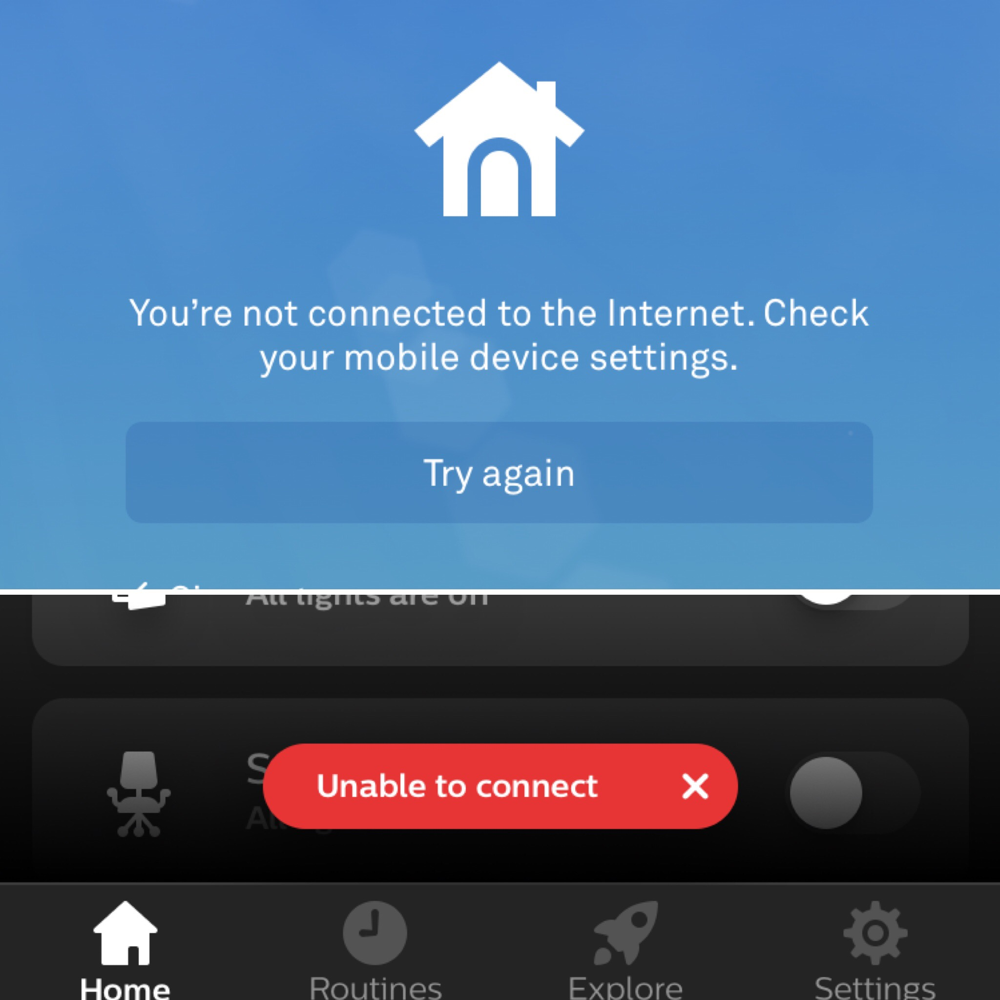

The idea of an intelligent home that understands your behaviour and routines – automatically controlling lighting, climate, entertainment and looking after your security – used to be science fiction. Now we are living in the future and it kind of sucks. Here are a few things I think are wrong with the current smart home reality.

### Smart doesn’t really mean smart

The first problem with current smart home tech is that manufacturers have started calling any device with basic internet connectivity or a connected smartphone app ‘smart’.

Take for example ‘smart’ TVs, does my TV know which member of my household is watching TV? Does it learn what I watch and when I watch it and offer recommendations or alert me when I’m about to miss my favourite TV show? Does it make suggestions about taking a break or standing up to improve my health in the middle of an 8 hour Netflix binge? That kind of thing would be smart, instead the minimum requirement seems to be that a smart TV can connect to the internet and that you can access Netflix or BBC iPlayer on it.

Smart plugs and smart lights offer the ability to be remotely turned on or off, smart thermostats do much the same thing as normal thermostats but with fancier displays and the ability to control it from your phone, or even by shouting at Alexa. What these devices really are is ‘connected’ – they have potential to become smart with the right controller, but by themselves they are not smart.